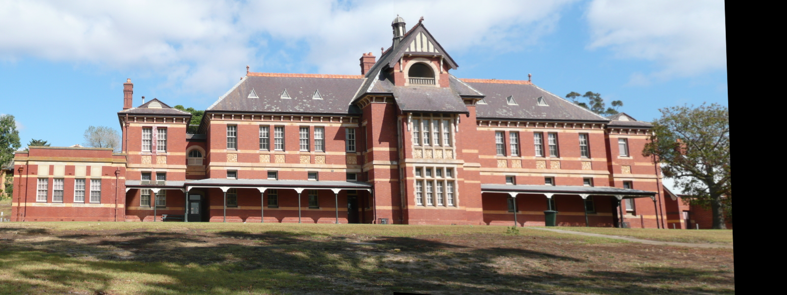

# Image Stitching

The idea of this project is to stitch two photos together and construct a panorma photo using Python and OpenCV. This is achieved with the help of computer vision and image processing techniques like: keypoint detection, local invariant descriptors, keypoint matching, the RANSAC algorithm and perspective warping.

## Solution
The image stitching algorithm is made up of 4 steps:
 1. **Detect keypoints and extract local invariant descriptors from the two input images**
 2. **Match the descriptors between the two images**
 3. **With the help of the RANSAC algorithm estimate a homography matrix using the matched feature vectors**
 4. **Apply a warping transformation using the homography matrix**

First, we find the keypoints and descriptors of both images with SIFT (Scale-Invariant Feature Transform), which is used for detecting and describing local fatures in images 

    sift = cv2.xfeatures2d.SIFT_create()
    kp1, des1 = sift.detectAndCompute(img_right_bw, None)  
    kp2, des2 = sift.detectAndCompute(img_left_bw, None)

After that we find the overlapping points between the two images with Brute Force Matcher, where k=2 is the parameter that gives out the best 2 matches for each descriptor and returns a list of lists, where each sublist contains k=2 objects:

    bfmatcher = cv2.BFMatcher()
    matching_descriptors = bfmatcher.knnMatch(des1, des2, k=2)

We single out the good matches with the function named **find_good_matches(descriptors, ratio)** where descriptors is list of overlapping points found with the BFMatcher and a specified ratio. 
We apply ratio test using the top 2 matches obtained above. We consider a match if the ratio defined below is greater than the ratio passed as an argument in the function.

    def find_good_matches(descriptors, ratio): 
	    good = []  
	    for m, n in descriptors:  
	        if m.distance < ratio * n.distance:  
	            good.append(m)  
	    return good
Now, to compute the homography matrix, we need at least 4 good matches. Before estimating the homography matrix, we need to convert our keypoints to an argument suitable for the findHomography() function.

    src_pts = np.float32([kp1[m.queryIdx].pt for m in good_matches]).reshape(-1, 1, 2)  
    dst_pts = np.float32([kp2[m.trainIdx].pt for m in good_matches]).reshape(-1, 1, 2)  
    M, mask = cv2.findHomography(src_pts, dst_pts, cv2.RANSAC, 5.0)
    height, width = img_right_bw.shape  
    pts = np.float32([[0, 0], [0, height - 1], [width - 1, height - 1], [width - 1, 0]]).reshape(-1, 1, 2)
    dst = cv2.perspectiveTransform(pts, M)  

Now that the homography matrix is established, we need to warp perspective (change the field of view) - apply the homography matrix to the image:

    dst = cv2.warpPerspective(img_right, M, (img_left.shape[1] + img_right.shape[1], img_left.shape[0]))
    dst[0:img_left.shape[0], 0:img_left.shape[1]] = img_left
    
   In the above 2 lines, we are taking the overlapping area from the images. In "dst" there's only the right side of image which is not overlapped, so in the second line of code we are placing our left side image into the final product and it looks like this:
   
   To remove the black sides of the image, we use the following function:
   

    def trim(frame):
	    # crop top
	    if not np.sum(frame[0]):
	        return trim(frame[1:])
	    # crop bottom
	    elif not np.sum(frame[-1]):
	        return trim(frame[:-2])
	    # crop left
	    elif not np.sum(frame[:, 0]):
	        return trim(frame[:, 1:])
	    # crop right
	    elif not np.sum(frame[:, -1]):
	        return trim(frame[:, :-2])
	    return frame
  
  And we get the final product:
  
